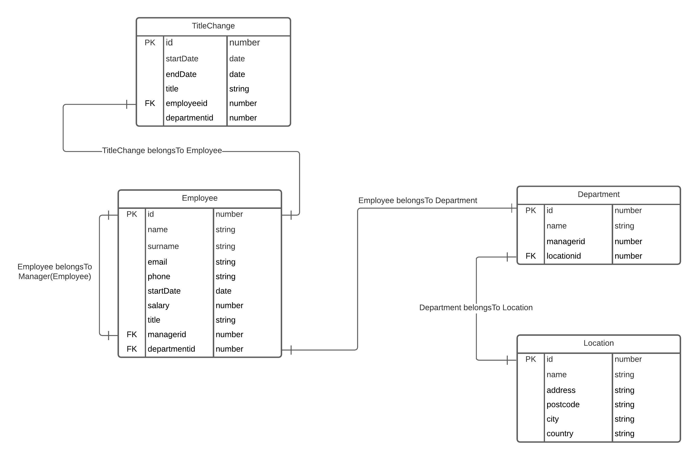

# employee-management-system

**employee-management-system** is a **Loopback.js 4** project with **TypeScript** and **PostgreSQL**. It can be used to manage a company's employees, departments, office locations etc.

## Setting up the project

1. Make sure you have got [PostgreSQL v12.4](https://formulae.brew.sh/formula/postgresql) database system installed using [Homebrew](https://brew.sh/).

```bash
brew install postgresql@12
```

2. This project utilizes Docker and `docker-compose`:

     1. Install [Docker](https://www.docker.com/products/docker-desktop).

     2. Install `docker-compose`:

```bash
pip3 install docker-compose
```

3. Run the project with the following command. Database tables and initial data will be automatically created.

```bash
docker-compose up --build
```

## Running tests

Execute following command to run the tests:

```bash
docker exec employee-management-system_app_1 npm run test
```


## Endpoints


### GET /address?latitude={latitude}&longitude={longitude}

Connects to [BigDataCloud Reverse Geocoding API](https://www.bigdatacloud.com/geocoding-apis/free-reverse-geocode-to-city-api) and retrieves address information from (`latitude`, `longitude`) pair

##### Example Request:

```http
/address?latitude=48.1351&longitude=11.5820
```

##### Example Response Body:

```
{
  "city": "Munich",
  "country": "Germany",
  "postcode": "80331",
  "address": "Bavaria"
}
```

---

### GET /departments/{id}/averageSalary

Calculates average salary of employees in a specified department with id `id`.

##### Example Request:

```http
/departments/1/averageSalary
```

##### Example Response Body:

Department 1 has got three employees with salaries 20000, 10000 and 11000. Average salary gets calculated by `SalaryService`.

```
13075
```

---

### GET /employees/{id}/history

Retrieves title changes (most recent first) of an employee with id `id`.

##### Example Request:

```http
/employees/3/history
```

##### Example Response Body:

```
{
  "id": 3,
  "name": "Annie",
  "surname": "Carter",
  "email": "cartera@gmail.com",
  "phone": "05091112233",
  "startdate": "2020-09-02T16:45:56.615Z",
  "salary": 10000,
  "title": "Software Engineer",
  "managerId": 1,
  "departmentId": 1,
  "titleChanges": [
    {
      "id": 3,
      "startDate": "2019-09-06T14:06:51.596Z",
      "endDate": null,
      "title": "Software Engineer",
      "departmentId": 1,
      "employeeId": 3
    },
    {
      "id": 1,
      "startDate": "2018-09-06T14:06:51.596Z",
      "endDate": "2019-09-06T14:06:51.596Z",
      "title": "Specialist",
      "departmentId": 1,
      "employeeId": 3
    }
  ]
}
```

---

### GET /hierarchy

Retrieves list of employees with title `'Manager'` associated with the employees reporting to them.

##### Example Request:

```http
/hierarchy
```
##### Example Response Body:

```
[
  {
    "Adam": [
      {
        "name": "Annie"
      },
      {
        "name": "Grace"
      },
      {
        "name": "Sabre"
      }
    ]
  },
  {
    "Ahmet": []
  },
  {
    "Julian": [
      {
        "name": "Farrah"
      }
    ]
  }
]
```

---

### GET /managers

Retrieves detailed list of employees with title `'Manager'`.

##### Example Request:

```http
/managers
```
##### Example Response Body:

```
[
  {
    "id": 1,
    "name": "Adam",
    "surname": "Smith",
    "email": "adam@gmail.com",
    "phone": "05321234567",
    "startdate": "2020-09-04T16:45:56.615Z",
    "salary": 20000,
    "title": "Manager",
    "managerId": 0,
    "departmentId": 1
  },
  {
    "id": 2,
    "name": "Ahmet",
    "surname": "Kaptan",
    "email": "akaptan@gmail.com",
    "phone": "05077654321",
    "startdate": "2020-09-02T16:45:56.615Z",
    "salary": 21000,
    "title": "Manager",
    "managerId": 0,
    "departmentId": 2
  },
  {
    "id": 7,
    "name": "Julian",
    "surname": "Bream",
    "email": "jbrip@gmail.com",
    "phone": "05009876543",
    "startdate": "2020-09-02T16:45:56.615Z",
    "salary": 18900,
    "title": "Manager",
    "managerId": 0,
    "departmentId": 3
  }
]
```

## Database Schema Diagram



## Improvements

- Put all config variables into environment variables
- Create different environments for prod, dev and test
- Complete unit tests
- Improve schema relations
- Add authentication and authorization
- Add a logger
